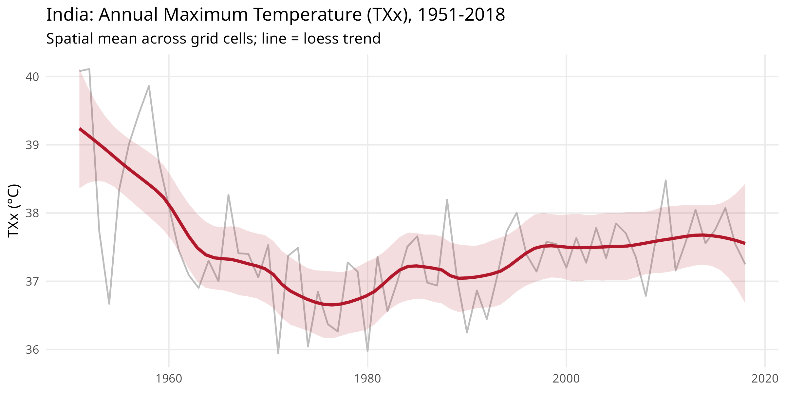
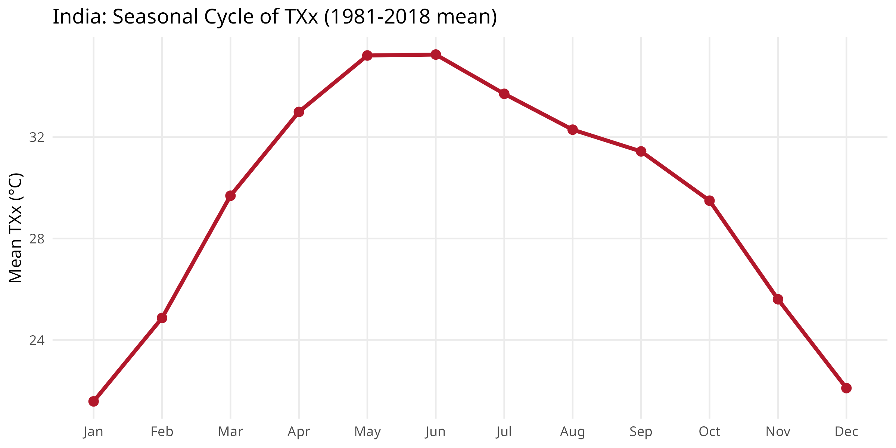
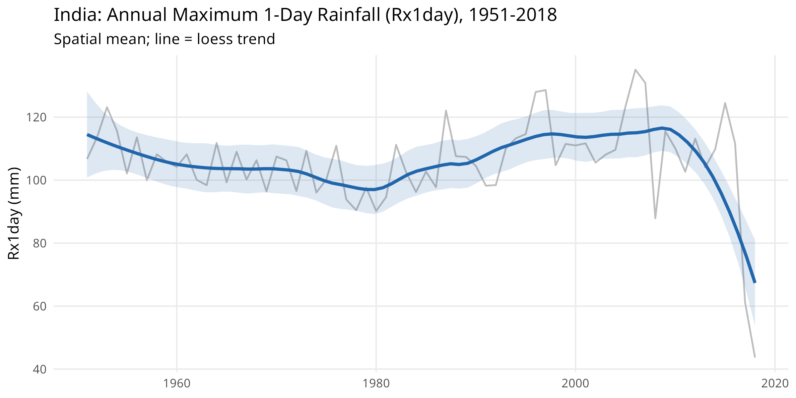
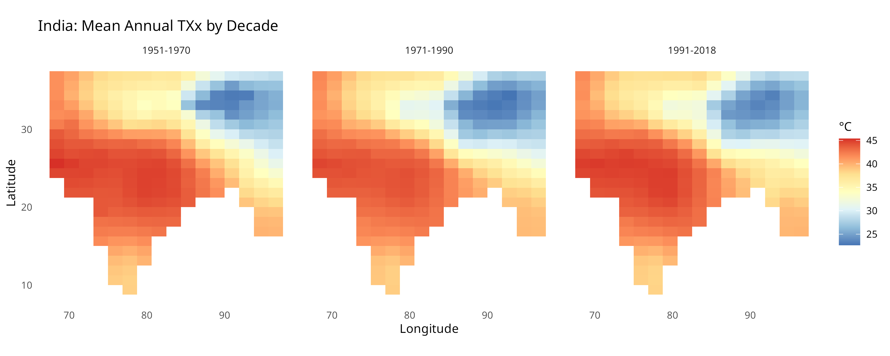

# HadEX3 Climate Extremes: India

``` r
library(varunayan)
library(dplyr)
library(ggplot2)
library(tidyr)
```

The [HadEX3](https://www.metoffice.gov.uk/hadobs/hadex3/) dataset from
the Met Office Hadley Centre provides global gridded climate extremes
based on 27 ETCCDI indices, at 1.25 x 1.875 degree resolution over
1901-2018.

Available indices and their descriptions:

``` r
list_hadex3_indices() |>
  select(index, category, description, unit, annual, monthly) |>
  head(12)
#    index               category                           description unit
# 1    TXx            Temperature   Max of daily max temp (hottest day)   °C
# 2    TXn            Temperature   Min of daily max temp (coldest day)   °C
# 3    TNx            Temperature Max of daily min temp (warmest night)   °C
# 4    TNn            Temperature Min of daily min temp (coldest night)   °C
# 5  TX90p Temperature percentile      % days with TX > 90th percentile    %
# 6  TX10p Temperature percentile      % days with TX < 10th percentile    %
# 7  TN90p Temperature percentile      % days with TN > 90th percentile    %
# 8  TN10p Temperature percentile      % days with TN < 10th percentile    %
# 9     TR  Temperature threshold           Tropical nights (TN > 20°C) days
# 10    SU  Temperature threshold               Summer days (TX > 25°C) days
# 11    FD  Temperature threshold                 Frost days (TN < 0°C) days
# 12    ID  Temperature threshold                   Ice days (TX < 0°C) days
#    annual monthly
# 1    TRUE    TRUE
# 2    TRUE    TRUE
# 3    TRUE    TRUE
# 4    TRUE    TRUE
# 5    TRUE    TRUE
# 6    TRUE    TRUE
# 7    TRUE    TRUE
# 8    TRUE    TRUE
# 9    TRUE    TRUE
# 10   TRUE    TRUE
# 11   TRUE    TRUE
# 12   TRUE    TRUE
```

## Download

``` r
# Annual TXx (max of daily max temp) for India
india_txx <- hadex3_bbox(
  index = "TXx",
  start_year = 1951, end_year = 2018,
  north = 37, south = 6, east = 98, west = 68,
  frequency = "annual"
)

# Annual Rx1day (max 1-day rainfall) for India
india_rx1day <- hadex3_bbox(
  index = "Rx1day",
  start_year = 1951, end_year = 2018,
  north = 37, south = 6, east = 98, west = 68,
  frequency = "annual"
)

# Monthly TXx for seasonal analysis
india_txx_mon <- hadex3_bbox(
  index = "TXx",
  start_year = 1981, end_year = 2018,
  north = 37, south = 6, east = 98, west = 68,
  frequency = "monthly"
)
```

``` r
saved <- readRDS(system.file("extdata", "india_hadex3.rds", package = "varunayan"))
india_txx <- saved$TXx_annual
india_rx1day <- saved$Rx1day_annual
india_txx_mon <- saved$TXx_monthly
```

## Annual Temperature Extremes Trend

Annual TXx (hottest day) for India: spatial mean across grid cells, with
a 10-year running mean trend.

``` r
txx_annual <- india_txx |>
  group_by(year) |>
  summarise(mean_txx = mean(value, na.rm = TRUE), .groups = "drop")

ggplot(txx_annual, aes(x = year, y = mean_txx)) +
  geom_line(color = "#BDBDBD", linewidth = 0.6) +
  geom_smooth(
    method = "loess", span = 0.3, se = TRUE,
    color = "#B2182B", fill = "#B2182B", alpha = 0.15, linewidth = 1.1
  ) +
  labs(
    x = NULL, y = "TXx (\u00b0C)",
    title = "India: Annual Maximum Temperature (TXx), 1951-2018",
    subtitle = "Spatial mean across grid cells; line = loess trend"
  ) +
  theme_minimal(base_size = 11) +
  theme(panel.grid.minor = element_blank())
```



## Seasonal Patterns from Monthly Data

Monthly TXx averaged over 1981-2018 shows the typical pre-monsoon peak
in May-June and the cooler post-monsoon period.

``` r
seasonal <- india_txx_mon |>
  group_by(month) |>
  summarise(mean_txx = mean(value, na.rm = TRUE), .groups = "drop") |>
  mutate(month_label = factor(month.abb[month], levels = month.abb))

ggplot(seasonal, aes(x = month_label, y = mean_txx, group = 1)) +
  geom_line(color = "#B2182B", linewidth = 1.2) +
  geom_point(color = "#B2182B", size = 2.5) +
  labs(
    x = NULL, y = "Mean TXx (\u00b0C)",
    title = "India: Seasonal Cycle of TXx (1981-2018 mean)"
  ) +
  theme_minimal(base_size = 11) +
  theme(panel.grid.minor = element_blank())
```



## Extreme Rainfall Trend (Rx1day)

Annual maximum 1-day precipitation (Rx1day) over India 1951-2018.

``` r
rx1_annual <- india_rx1day |>
  group_by(year) |>
  summarise(mean_rx1 = mean(value, na.rm = TRUE), .groups = "drop")

ggplot(rx1_annual, aes(x = year, y = mean_rx1)) +
  geom_line(color = "#BDBDBD", linewidth = 0.6) +
  geom_smooth(
    method = "loess", span = 0.35, se = TRUE,
    color = "#2166AC", fill = "#2166AC", alpha = 0.15, linewidth = 1.1
  ) +
  labs(
    x = NULL, y = "Rx1day (mm)",
    title = "India: Annual Maximum 1-Day Rainfall (Rx1day), 1951-2018",
    subtitle = "Spatial mean; line = loess trend"
  ) +
  theme_minimal(base_size = 11) +
  theme(panel.grid.minor = element_blank())
```



## Decadal Spatial Distribution of TXx

Comparing the spatial pattern of TXx across three decades.

``` r
decades <- india_txx |>
  mutate(decade = cut(year,
    breaks = c(1950, 1970, 1990, 2018),
    labels = c("1951-1970", "1971-1990", "1991-2018"),
    include.lowest = TRUE
  )) |>
  group_by(decade, latitude, longitude) |>
  summarise(mean_txx = mean(value, na.rm = TRUE), .groups = "drop")

ggplot(decades, aes(x = longitude, y = latitude, fill = mean_txx)) +
  geom_tile() +
  scale_fill_distiller(palette = "RdYlBu", direction = -1, name = "\u00b0C") +
  coord_fixed(ratio = 1) +
  facet_wrap(~decade, nrow = 1) +
  labs(
    x = "Longitude", y = "Latitude",
    title = "India: Mean Annual TXx by Decade"
  ) +
  theme_minimal(base_size = 10) +
  theme(panel.grid = element_blank())
```


