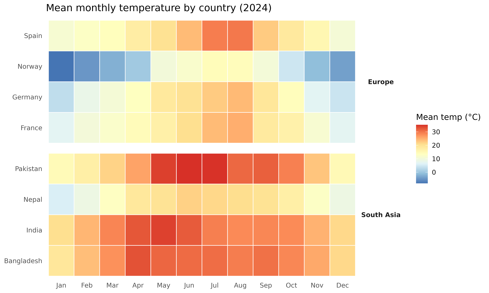
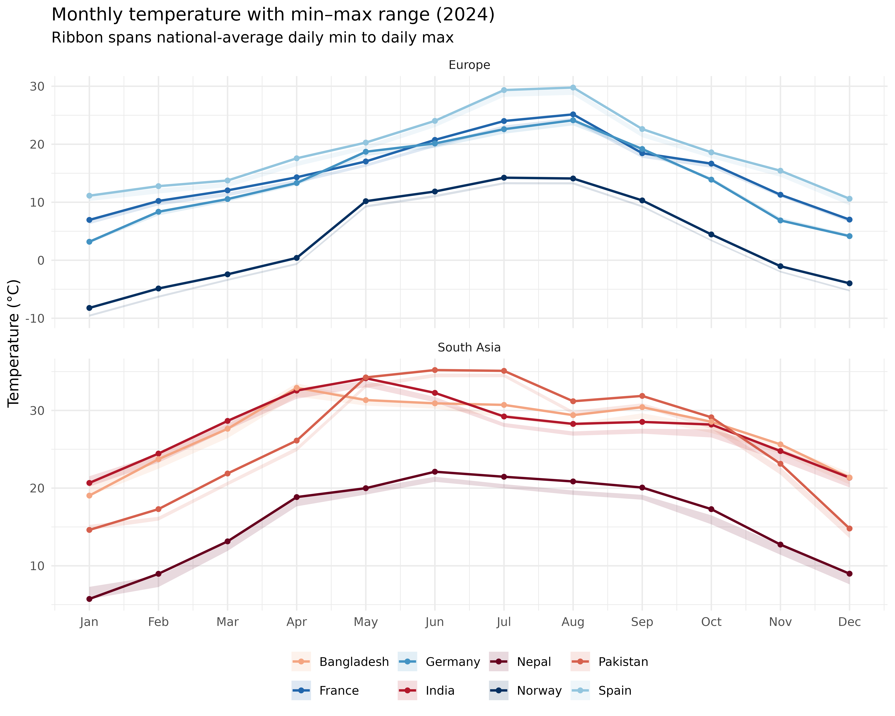
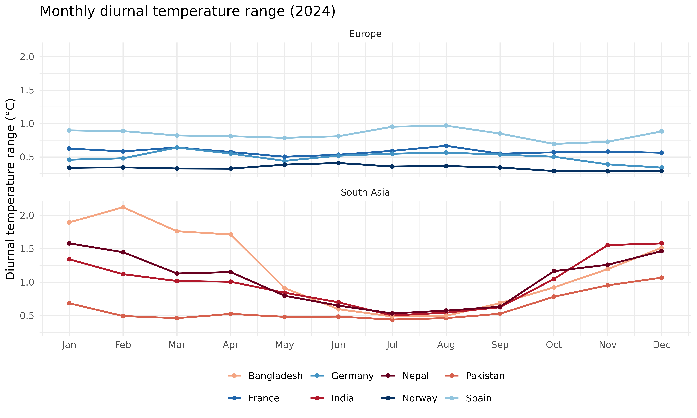
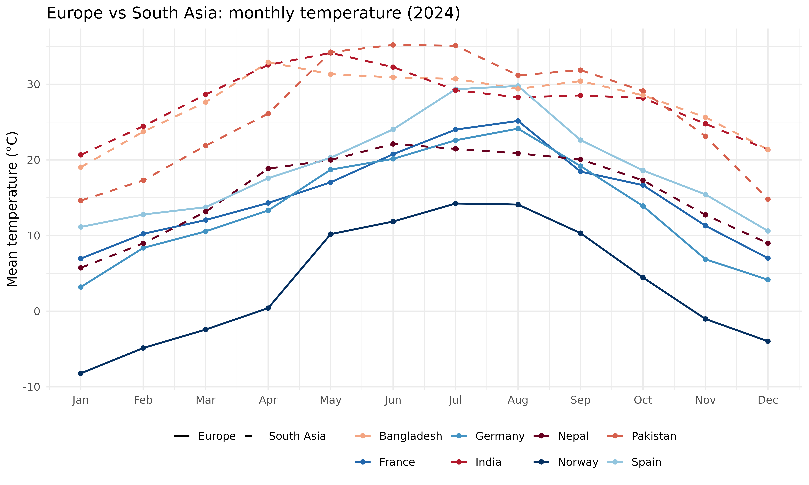

# Country-level temperature trends

``` r
library(varunayan)
library(dplyr)
library(ggplot2)
library(tidyr)
library(patchwork)
```

[`get_era5_country_temperature()`](https://saketlab.github.io/varunayanR/dev/reference/get_era5_country_temperature.md)
resolves a country boundary, downloads monthly ERA5 data, and returns
cosine-latitude area-weighted national averages. One call replaces the
manual workflow of finding boundaries, writing GeoJSON, calling
[`era5ify_geojson()`](https://saketlab.github.io/varunayanR/dev/reference/era5ify_geojson.md),
and aggregating grid cells.

Below we compare monthly mean, max, and min temperatures across four
European and four South Asian countries for 2024.

## Download data

The `variables` argument accepts shorthands `"mean"`, `"max"`, and
`"min"`.

``` r
countries <- c("France", "Germany", "Spain", "Norway",
               "India", "Pakistan", "Bangladesh", "Nepal")

all_data <- lapply(countries, function(cntry) {
  df <- get_era5_country_temperature(
    country    = cntry,
    start_date = "2024-01-01",
    end_date   = "2024-12-31",
    variables  = c("mean", "max", "min")
  )
  df$country <- cntry
  df
})

temps <- bind_rows(all_data)
```

``` r
head(temps)
#   year month temperature_max temperature_mean temperature_min country
# 1 2024     1        6.852207         6.953495        6.225498  France
# 2 2024     2       10.040868        10.223489        9.456424  France
# 3 2024     3       11.683986        12.049970       11.041785  France
# 4 2024     4       13.844017        14.307139       13.269198  France
# 5 2024     5       16.621092        17.035453       16.117049  France
# 6 2024     6       20.049674        20.751232       19.515942  France
```

Tag each country with its region for faceting.

``` r
region_map <- c(
  France = "Europe", Germany = "Europe", Spain = "Europe", Norway = "Europe",
  India = "South Asia", Pakistan = "South Asia",
  Bangladesh = "South Asia", Nepal = "South Asia"
)

temps$region <- region_map[temps$country]
temps$month_label <- factor(month.abb[temps$month], levels = month.abb)

# Cool tones for Europe, warm tones for South Asia
country_colors <- c(
  France = "#2166AC", Germany = "#4393C3",
  Spain = "#92C5DE", Norway = "#053061",
  India = "#B2182B", Pakistan = "#D6604D",
  Bangladesh = "#F4A582", Nepal = "#67001F"
)
```

## Seasonal heatmap

``` r
ggplot(temps, aes(x = month_label, y = country, fill = temperature_mean)) +
  geom_tile(color = "white", linewidth = 0.4) +
  facet_grid(region ~ ., scales = "free_y", space = "free_y") +
  scale_fill_distiller(palette = "RdYlBu", direction = -1,
                       name = "Mean temp (\u00B0C)") +
  labs(x = NULL, y = NULL,
       title = "Mean monthly temperature by country (2024)") +
  theme_minimal(base_size = 12) +
  theme(panel.grid = element_blank(),
        strip.text.y = element_text(angle = 0, face = "bold"))
```



South Asian countries stay above 20 °C year-round. European countries
swing 20+ °C between winter and summer, with Norway dropping below
freezing from November through March.

## Monthly trend lines with min/max ribbon

The ribbon spans national-average daily min to daily max temperature.

``` r
ggplot(temps, aes(x = month, color = country, fill = country)) +
  geom_ribbon(aes(ymin = temperature_min, ymax = temperature_max),
              alpha = 0.15, color = NA) +
  geom_line(aes(y = temperature_mean), linewidth = 0.9) +
  geom_point(aes(y = temperature_mean), size = 1.5) +
  facet_wrap(~ region, ncol = 1, scales = "free_y") +
  scale_color_manual(values = country_colors) +
  scale_fill_manual(values = country_colors) +
  scale_x_continuous(breaks = 1:12, labels = month.abb) +
  labs(x = NULL, y = "Temperature (\u00B0C)",
       title = "Monthly temperature with min\u2013max range (2024)",
       subtitle = "Ribbon spans national-average daily min to daily max",
       color = NULL, fill = NULL) +
  theme_minimal(base_size = 12) +
  theme(legend.position = "bottom")
```



## Diurnal range

The gap between daily max and min (DTR) is wider in continental and arid
climates than in humid tropical ones.

``` r
temps$dtr <- temps$temperature_max - temps$temperature_min

ggplot(temps, aes(x = month, y = dtr, color = country)) +
  geom_line(linewidth = 0.9) +
  geom_point(size = 1.5) +
  facet_wrap(~ region, ncol = 1) +
  scale_color_manual(values = country_colors) +
  scale_x_continuous(breaks = 1:12, labels = month.abb) +
  labs(x = NULL, y = "Diurnal temperature range (\u00B0C)",
       title = "Monthly diurnal temperature range (2024)",
       color = NULL) +
  theme_minimal(base_size = 12) +
  theme(legend.position = "bottom")
```



## Regional comparison

All eight countries on a single axis, with line type separating the two
regions.

``` r
ggplot(temps, aes(x = month, y = temperature_mean,
                  color = country, linetype = region)) +
  geom_line(linewidth = 0.8) +
  geom_point(size = 1.5) +
  scale_x_continuous(breaks = 1:12, labels = month.abb) +
  scale_color_manual(values = country_colors) +
  scale_linetype_manual(values = c("Europe" = "solid", "South Asia" = "dashed")) +
  labs(x = NULL, y = "Mean temperature (\u00B0C)",
       title = "Europe vs South Asia: monthly temperature (2024)",
       color = NULL, linetype = NULL) +
  theme_minimal(base_size = 12) +
  theme(legend.position = "bottom")
```


