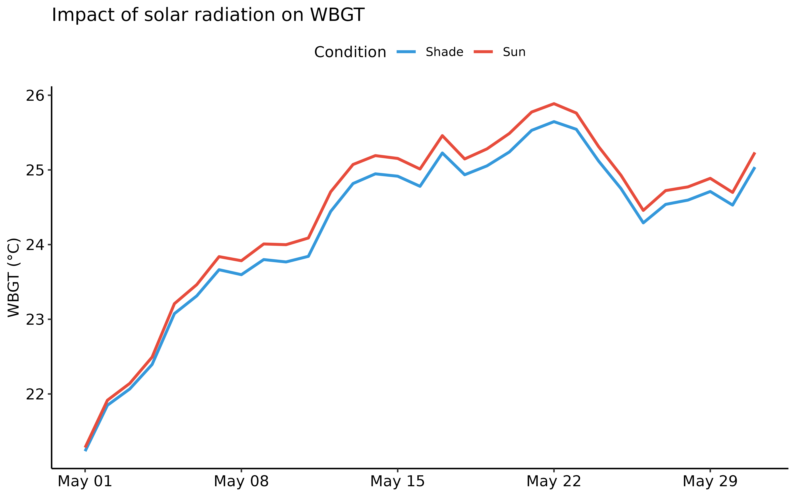
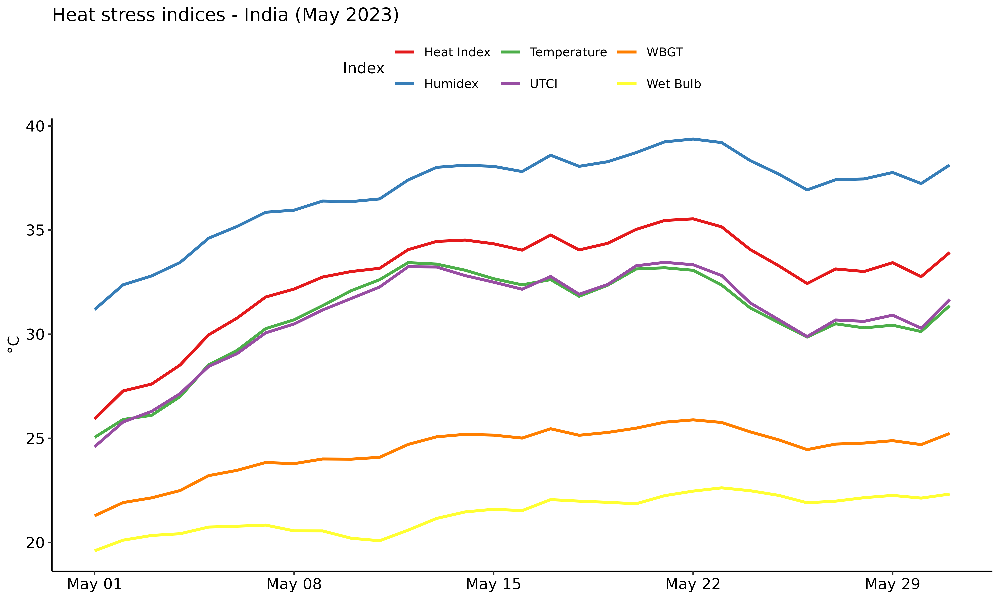
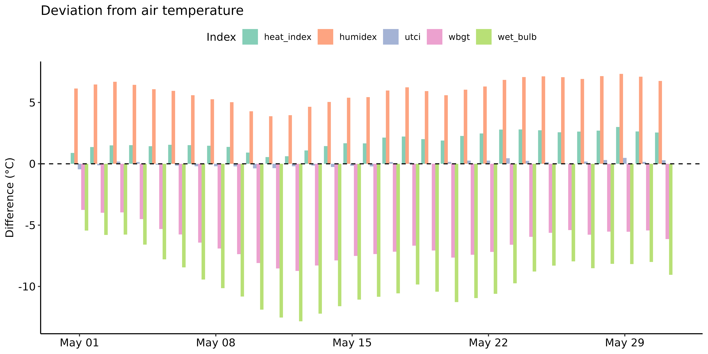
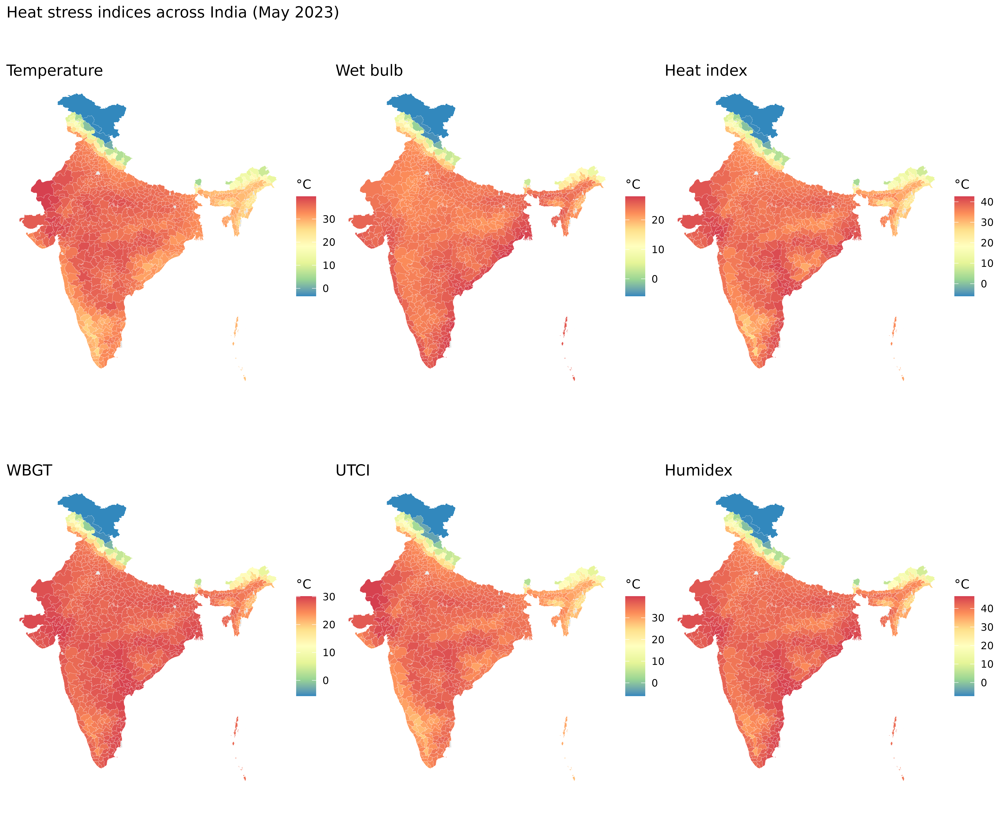
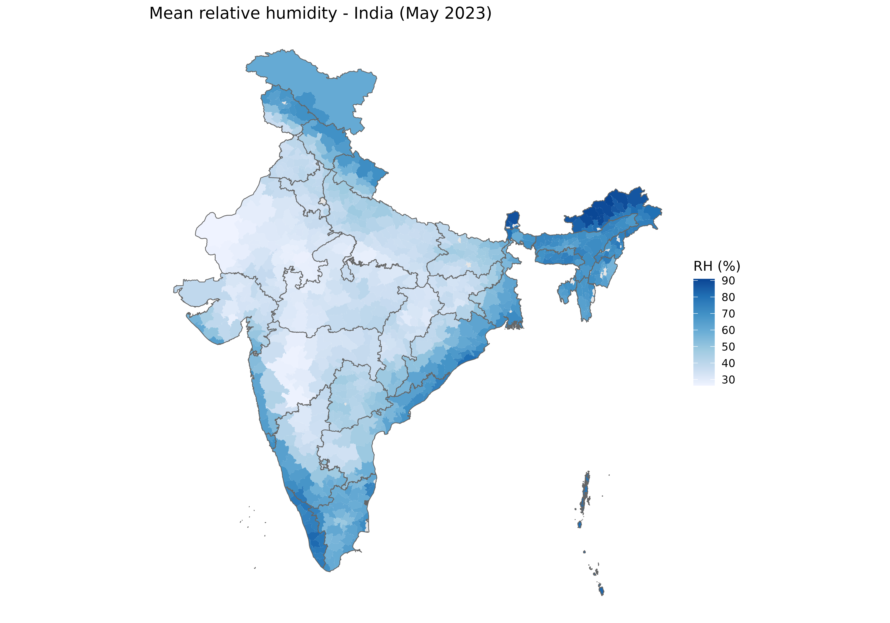
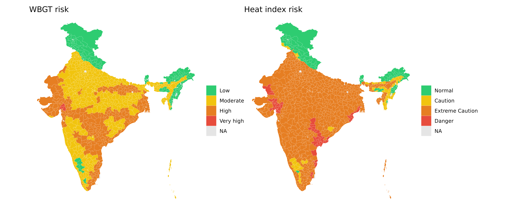
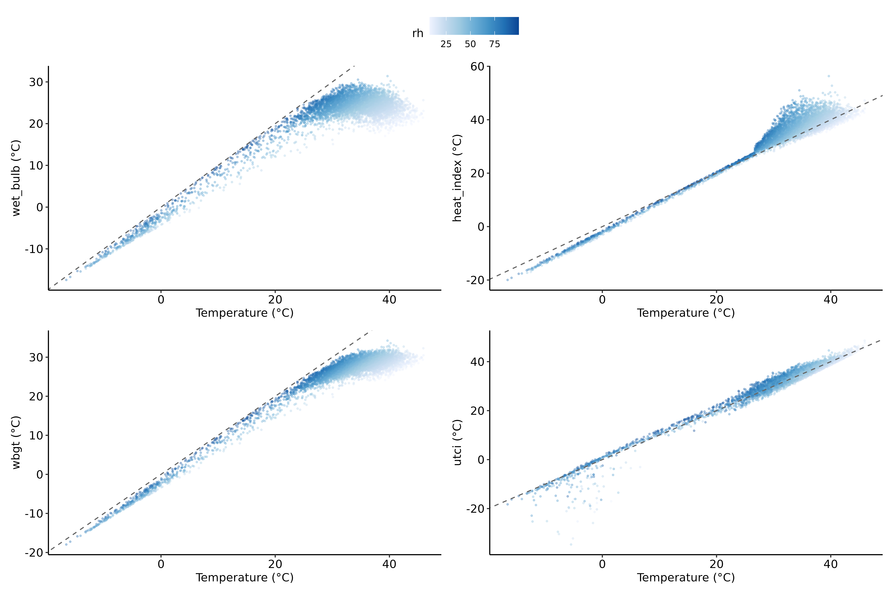
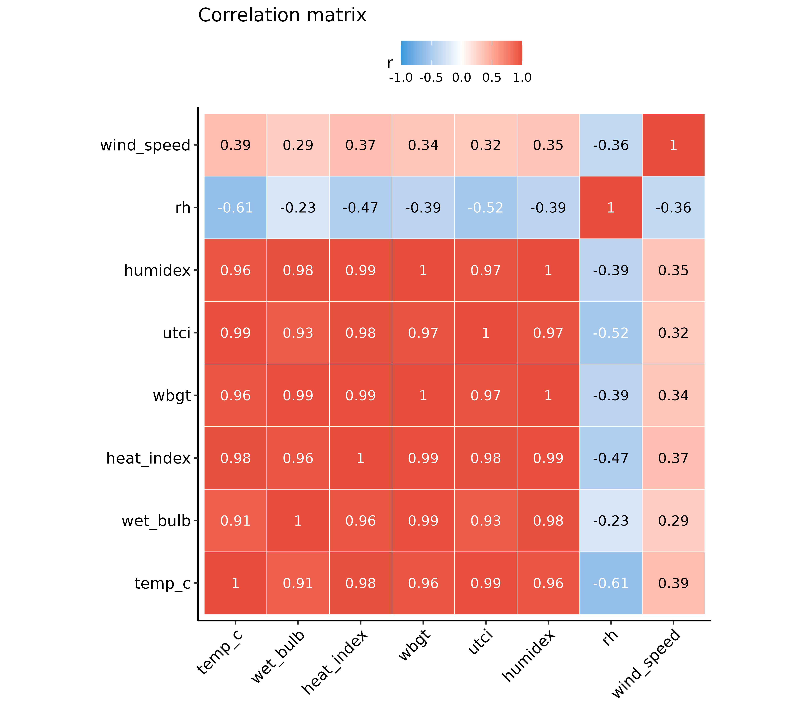

# Heat stress indices comparison

``` r
library(varunayan)
library(dplyr)
library(ggplot2)
library(sf)
library(lubridate)
library(tidyr)
library(patchwork)
library(ggpubr)
theme_set(theme_pubr(base_size = 11))
```

Any study interested in assessing the impact of climate change on health
outcomes would be interested in how excess heat affects human health.
However, air temperature alone is not a sufficient metric to quantify
heat stress, as humidity plays a crucial role in the body’s ability to
cool itself through sweating.

In this vignette, we demonstrate how to calculate and compare different
heat stress indices from ERA5 climate data. In particular, we compare
the following indices:

- **Air Temperature (T)**: Standard 2m temperature
- **Wet Bulb Temperature (Tw)**: Temperature accounting for humidity
  (evaporative cooling)
- **Heat Index (HI)**: Apparent temperature (how hot it “feels”)
- **WBGT**: Wet Bulb Globe Temperature (occupational heat stress
  standard)
- **UTCI**: Universal Thermal Climate Index (comprehensive thermal
  comfort)
- **Humidex**: Canadian heat discomfort index

### Why multiple indices?

Air temperature alone doesn’t capture heat stress because humidity plays
a critical role in the body’s ability to cool through sweating. Each
index captures different aspects of thermal stress:

| Index       | Purpose                       | Key Factors                | Primary Use           |
|-------------|-------------------------------|----------------------------|-----------------------|
| Temperature | Actual air temperature        | Dry bulb only              | Baseline measurement  |
| Wet Bulb    | Evaporative cooling potential | T + Humidity               | Physiological limit   |
| Heat Index  | Perceived temperature         | T + RH (empirical)         | Public weather alerts |
| WBGT        | Occupational heat limits      | Tw + T + Radiation         | Workplace safety      |
| UTCI        | Comprehensive thermal comfort | T + Tmrt + Wind + Humidity | Climate research      |
| Humidex     | Comfort assessment            | T + Dewpoint               | Canadian weather      |

### Understanding the indexes

We will use the following nomenclature throughout this vignette:

| Symbol   | Description                     | Unit |
|----------|---------------------------------|------|
| T, Ta    | Air temperature (dry bulb)      | °C   |
| Td       | Dewpoint temperature            | °C   |
| Tw, Tnwb | Wet bulb temperature (natural)  | °C   |
| Tg       | Globe temperature               | °C   |
| Tmrt     | Mean radiant temperature        | °C   |
| RH       | Relative humidity               | %    |
| e        | Vapor pressure                  | hPa  |
| HI       | Heat Index                      | °C   |
| WBGT     | Wet Bulb Globe Temperature      | °C   |
| UTCI     | Universal Thermal Climate Index | °C   |

#### Wet bulb temperature (Tw)

The wet bulb temperature represents the lowest temperature that can be
achieved through evaporative cooling alone. It’s calculated using the
[Stull
(2011)](https://journals.ametsoc.org/view/journals/apme/50/11/jamc-d-11-0143.1.xml)
formula:

$$T_{w} = T \cdot \arctan\left\lbrack 0.151977(RH + 8.313659)^{0.5} \right\rbrack + \arctan(T + RH) - \arctan(RH - 1.676331) + 0.00391838 \cdot RH^{1.5} \cdot \arctan(0.023101 \cdot RH) - 4.686035$$

A wet bulb temperature of 35°C is considered the upper limit for human
survivability, as the body cannot cool itself through sweating at this
point (the air is so hot and humid that sweating no longer cools the
body!).

#### Heat Index (HI)

The Heat Index uses the [Rothfusz regression
equation](https://www.weather.gov/media/ffc/ta_htindx.PDF) from the US
National Weather Service:

$$HI = - 42.379 + 2.049T + 10.143RH - 0.225T \cdot RH - 0.007T^{2} - 0.055RH^{2} + ...$$

Risk categories: - **Normal** (\<27°C): No special precautions -
**Caution** (27-32°C): Fatigue possible with prolonged exposure -
**Extreme Caution** (32-41°C): Heat cramps and exhaustion possible -
**Danger** (41-54°C): Heat exhaustion likely, heat stroke possible -
**Extreme Danger** (\>54°C): Heat stroke highly likely

#### WBGT (Wet Bulb Globe Temperature)

WBGT is the [ISO 7243](https://www.iso.org/standard/67188.html) standard
for occupational heat stress:

$$WBGT_{outdoor} = 0.7 \cdot T_{nwb} + 0.2 \cdot T_{g} + 0.1 \cdot T_{a}$$
Where $T_{nwb}$ is natural wet bulb, $T_{g}$ is globe temperature
(accounting for radiation), and $T_{a}$ is air temperature.

Risk categories based on ISO 7243: - **Low** (\<25°C): Safe for most
activities - **Moderate** (25-28°C): Exercise caution - **High**
(28-30°C): Reduce physical activity - **Very High** (30-32°C): Minimize
outdoor work - **Extreme** (\>32°C): Suspend heavy outdoor work

#### UTCI (Universal Thermal Climate Index)

UTCI is the most comprehensive thermal comfort index, based on a
multi-node model of human thermoregulation ([Bröde et al.,
2012](https://doi.org/10.1007/s00484-011-0454-1)). We use the sparse
regression approximation from [Roman et
al. (2025)](https://doi.org/10.5281/zenodo.17465548):

The UTCI considers: - Air temperature - Mean radiant temperature - Wind
speed at 10m - Relative humidity

Thermal stress categories: - **Extreme cold stress** (\<-40°C) - **Very
strong cold stress** (-40 to -27°C) - **Strong cold stress** (-27 to
-13°C) - **Moderate cold stress** (-13 to 0°C) - **Slight cold stress**
(0 to 9°C) - **No thermal stress** (9 to 26°C) - **Moderate heat
Stress** (26 to 32°C) - **Strong heat stress** (32 to 38°C) - **Very
strong heat stress** (38 to 46°C) - **Extreme heat stress** (\>46°C)

#### Humidex

The Canadian
[Humidex](https://climate.weather.gc.ca/glossary_e.html#humidex) is
calculated as:

$$H = T + 0.5555 \cdot (e - 10)$$

Where
$e = 6.11 \cdot \exp\left( 5417.7530 \cdot \left( 1/273.16 - 1/\left( 273.15 + T_{d} \right) \right) \right)$
is the vapor pressure.

## Calculating heat indices using ERA5 data

We have defined a helper function
[`GetERA5DailyHeatIndexData()`](https://saketlab.github.io/varunayanR/dev/reference/GetERA5DailyHeatIndexData.md)
which downloads temperature, dewpoint, and wind data and calculates all
heat stress indices in one call.

``` r
states_url <- "https://bharatviz.saketlab.org/India_LGD_states.geojson"
states_file <- "indian_states.geojson"

if (!file.exists(states_file)) {
  download.file(states_url, states_file, mode = "wb")
}

states_sf <- sf::st_read(states_file, quiet = TRUE)
```

``` r
heat_shade <- GetERA5DailyHeatIndexData(
  request_id = "india_heat_may2023_shade",
  start_date = "2023-05-01",
  end_date = "2023-05-31",
  json_file = states_file,
  solar_load = FALSE
)
#   |                                                                              |                                                                      |   0%  |                                                                              |=                                                                     |   2%  |                                                                              |===                                                                   |   4%  |                                                                              |====                                                                  |   6%  |                                                                              |======                                                                |   8%  |                                                                              |=======                                                               |  10%  |                                                                              |==========                                                            |  14%  |                                                                              |=============                                                         |  18%  |                                                                              |=================                                                     |  24%  |                                                                              |=====================                                                 |  30%  |                                                                              |=======================                                               |  32%  |                                                                              |========================                                              |  34%  |                                                                              |==========================                                            |  36%  |                                                                              |===========================                                           |  38%  |                                                                              |============================                                          |  40%  |                                                                              |==============================                                        |  43%  |                                                                              |===============================                                       |  45%  |                                                                              |=================================                                     |  47%  |                                                                              |==================================                                    |  49%  |                                                                              |===================================                                   |  51%  |                                                                              |=====================================                                 |  53%  |                                                                              |======================================                                |  55%  |                                                                              |========================================                              |  57%  |                                                                              |=========================================                             |  59%  |                                                                              |=============================================                         |  65%  |                                                                              |================================================                      |  69%  |                                                                              |==================================================                    |  71%  |                                                                              |======================================================                |  77%  |                                                                              |==========================================================            |  83%  |                                                                              |=============================================================         |  87%  |                                                                              |==============================================================        |  89%  |                                                                              |=================================================================     |  93%  |                                                                              |======================================================================| 100%
#   |                                                                              |                                                                      |   0%  |                                                                              |=                                                                     |   2%  |                                                                              |===                                                                   |   4%  |                                                                              |====                                                                  |   6%  |                                                                              |=======                                                               |  10%  |                                                                              |========                                                              |  12%  |                                                                              |==========                                                            |  14%  |                                                                              |===========                                                           |  16%  |                                                                              |=================                                                     |  24%  |                                                                              |====================                                                  |  28%  |                                                                              |===================================                                   |  50%  |                                                                              |========================================                              |  58%  |                                                                              |====================================================                  |  74%  |                                                                              |======================================================================| 100%
#   |                                                                              |                                                                      |   0%  |                                                                              |==                                                                    |   3%  |                                                                              |=====                                                                 |   7%  |                                                                              |========                                                              |  12%  |                                                                              |===========                                                           |  16%  |                                                                              |=================                                                     |  25%  |                                                                              |========================                                              |  34%  |                                                                              |=========================                                             |  35%  |                                                                              |==============================                                        |  43%  |                                                                              |================================================                      |  69%  |                                                                              |==================================================                    |  72%  |                                                                              |======================================================================| 100%
#   |                                                                              |                                                                      |   0%  |                                                                              |==                                                                    |   3%  |                                                                              |====                                                                  |   6%  |                                                                              |=====                                                                 |   7%  |                                                                              |=======                                                               |  10%  |                                                                              |========                                                              |  12%  |                                                                              |==========                                                            |  15%  |                                                                              |===========                                                           |  16%  |                                                                              |============                                                          |  18%  |                                                                              |==================                                                    |  26%  |                                                                              |====================                                                  |  29%  |                                                                              |=======================                                               |  34%  |                                                                              |========================                                              |  35%  |                                                                              |==========================                                            |  36%  |                                                                              |============================                                          |  39%  |                                                                              |===============================                                       |  44%  |                                                                              |===============================================                       |  67%  |                                                                              |=================================================                     |  70%  |                                                                              |==================================================                    |  71%  |                                                                              |=====================================================                 |  76%  |                                                                              |=======================================================               |  79%  |                                                                              |======================================================================| 100%

heat_solar <- GetERA5DailyHeatIndexData(
  request_id = "india_heat_may2023_solar",
  start_date = "2023-05-01",
  end_date = "2023-05-31",
  json_file = states_file,
  solar_load = TRUE
)
#   |                                                                              |                                                                      |   0%  |                                                                              |=                                                                     |   2%  |                                                                              |==                                                                    |   3%  |                                                                              |====                                                                  |   5%  |                                                                              |=======                                                               |  10%  |                                                                              |========                                                              |  12%  |                                                                              |===========                                                           |  15%  |                                                                              |============                                                          |  17%  |                                                                              |=============                                                         |  19%  |                                                                              |==============                                                        |  21%  |                                                                              |================                                                      |  22%  |                                                                              |=================                                                     |  24%  |                                                                              |====================                                                  |  29%  |                                                                              |=======================                                               |  33%  |                                                                              |========================                                              |  34%  |                                                                              |=========================                                             |  36%  |                                                                              |===========================                                           |  38%  |                                                                              |============================                                          |  40%  |                                                                              |===============================                                       |  45%  |                                                                              |=================================                                     |  47%  |                                                                              |===================================                                   |  50%  |                                                                              |=====================================                                 |  53%  |                                                                              |=============================================                         |  64%  |                                                                              |========================================================              |  79%  |                                                                              |===================================================================   |  95%  |                                                                              |====================================================================  |  97%  |                                                                              |======================================================================| 100%

head(heat_solar)
#         date latitude longitude   temp_c dewpoint_c       rh wind_speed
# 1 2023-05-01    7.003  93.92789 29.49917   25.32015 78.28953   4.429024
# 2 2023-05-01    8.253  77.17731 26.75894   24.74203 88.72900   2.404126
# 3 2023-05-01    8.253  77.42732 27.29409   24.85336 86.55709   2.428025
# 4 2023-05-01    8.253  77.67733 27.54507   24.85238 85.28928   3.813376
# 5 2023-05-01    8.503  76.92730 26.62417   24.28500 87.02304   1.597042
# 6 2023-05-01    8.503  77.17731 26.16421   23.90609 87.40647   1.419242
#   solar_radiation wet_bulb heat_index     wbgt     utci  humidex wbgt_risk
# 1        147493.8 26.39243   35.74369 27.41648 30.10987 42.18977  Moderate
# 2        186597.8 25.24943   30.22752 25.73237 29.26413 38.81798  Moderate
# 3        239525.8 25.46756   31.26635 26.06151 29.65543 39.47322  Moderate
# 4        294949.8 25.53196   31.69988 26.19142 28.32418 39.72314  Moderate
# 5        121989.8 24.87850   27.61441 25.42696 29.78152 38.19779  Moderate
# 6        148901.8 24.48196   27.11847 25.00335 29.36105 37.34445  Moderate
#   heat_index_risk          utci_stress
# 1 Extreme Caution Moderate heat stress
# 2         Caution Moderate heat stress
# 3         Caution Moderate heat stress
# 4         Caution Moderate heat stress
# 5         Caution Moderate heat stress
# 6         Caution Moderate heat stress
```

### Solar load impact

When `solar_load = TRUE`, the function downloads solar radiation data
and uses it to calculate more accurate outdoor WBGT and UTCI values.
This accounts for the additional heat stress from direct sunlight.

``` r
daily_mean <- function(df, condition) {
  df %>%
    group_by(date) %>%
    summarise(WBGT = mean(wbgt), .groups = "drop") %>%
    mutate(Condition = condition)
}

solar_compare <- bind_rows(daily_mean(heat_shade, "Shade"), daily_mean(heat_solar, "Sun"))

ggplot(solar_compare, aes(date, WBGT, color = Condition)) +
  geom_line(linewidth = 1) +
  scale_color_manual(values = c(Shade = "#3498DB", Sun = "#E74C3C")) +
  labs(title = "Impact of solar radiation on WBGT", x = NULL, y = "WBGT (°C)")
```



The difference between sun and shade conditions shows the additional
thermal stress from solar radiation exposure, which can add several
degrees to WBGT.

### Temporal analysis

For the remaining analyses, we use the solar-loaded data as it better
represents outdoor conditions.

``` r
heat_data <- heat_solar
```

We can visualize the daily mean values of each heat stress index over
the month:

``` r
index_cols <- c(
  temp_c = "Temperature", wet_bulb = "Wet Bulb", heat_index = "Heat Index",
  wbgt = "WBGT", utci = "UTCI", humidex = "Humidex"
)

daily_indices <- heat_data %>%
  group_by(date) %>%
  summarise(across(names(index_cols), mean, na.rm = TRUE), .groups = "drop") %>%
  pivot_longer(-date, names_to = "Index", values_to = "value") %>%
  mutate(Index = index_cols[Index])

ggplot(daily_indices, aes(date, value, color = Index)) +
  geom_line(linewidth = 1) +
  scale_color_brewer(palette = "Set1") +
  labs(title = "Heat stress indices - India (May 2023)", x = NULL, y = "°C")
```



### Index differences from air temperature

``` r
daily_diff <- heat_data %>%
  mutate(across(c(wet_bulb, heat_index, wbgt, utci, humidex), ~ .x - temp_c)) %>%
  group_by(date) %>%
  summarise(across(c(wet_bulb, heat_index, wbgt, utci, humidex), mean, na.rm = TRUE), .groups = "drop") %>%
  pivot_longer(-date, names_to = "Index", values_to = "diff")

ggplot(daily_diff, aes(date, diff, fill = Index)) +
  geom_col(position = "dodge", alpha = 0.8) +
  geom_hline(yintercept = 0, linetype = "dashed") +
  scale_fill_brewer(palette = "Set2") +
  labs(title = "Deviation from air temperature", x = NULL, y = "Difference (°C)")
```



We make the following observations:

- **Wet Bulb** is always cooler than air temperature (due to evaporative
  cooling)
- **Heat Index** and **Humidex** are warmer when humidity is high
- **WBGT** and **UTCI** show elevated values due to solar radiation

### Spatial analysis

We can also visualize the spatial distribution of heat stress indices
across India.

``` r
districts_url <- "http://bharatviz.saketlab.org/India_LGD_districts.geojson"
districts_file <- "indian_districts.geojson"

if (!file.exists(districts_file)) {
  download.file(districts_url, districts_file, mode = "wb")
}

districts_sf <- sf::st_read(districts_file, quiet = TRUE)
```

``` r
heat_vars <- c("temp_c", "wet_bulb", "heat_index", "wbgt", "utci", "humidex", "rh")

monthly_heat <- heat_data %>%
  group_by(longitude, latitude) %>%
  summarise(across(all_of(heat_vars), mean, na.rm = TRUE), .groups = "drop") %>%
  st_as_sf(coords = c("longitude", "latitude"), crs = 4326)

district_map <- districts_sf %>%
  st_join(monthly_heat) %>%
  group_by(district_name, state_name) %>%
  summarise(across(all_of(heat_vars), mean, na.rm = TRUE), .groups = "drop")
```

``` r
heat_map <- function(var, title) {
  ggplot(district_map) +
    geom_sf(aes(fill = .data[[var]]), color = "white", linewidth = 0.05) +
    scale_fill_distiller(palette = "Spectral", name = "°C", na.value = "grey90") +
    labs(title = title) +
    theme_void()
}

(heat_map("temp_c", "Temperature") | heat_map("wet_bulb", "Wet bulb") | heat_map("heat_index", "Heat index")) /
  (heat_map("wbgt", "WBGT") | heat_map("utci", "UTCI") | heat_map("humidex", "Humidex")) +
  plot_annotation(title = "Heat stress indices across India (May 2023)")
```



### Relative humidity choropleth

``` r
ggplot() +
  geom_sf(data = district_map, aes(fill = rh), color = NA) +
  geom_sf(data = states_sf, fill = NA, color = "grey40", linewidth = 0.3) +
  scale_fill_distiller(palette = "Blues", direction = 1, name = "RH (%)", na.value = "grey90") +
  labs(title = "Mean relative humidity - India (May 2023)") +
  theme_void()
```



## Risk assessment

``` r
wbgt_levels <- c("Low", "Moderate", "High", "Very high", "Extreme")
hi_levels <- c("Normal", "Caution", "Extreme Caution", "Danger", "Extreme Danger")

district_map <- district_map %>%
  mutate(
    wbgt_risk = factor(wbgt_risk_category(wbgt), levels = wbgt_levels),
    hi_risk = factor(heat_index_risk_category(heat_index), levels = hi_levels),
    utci_stress = utci_category(utci)
  )

risk_colors <- c(
  Low = "#2ECC71", Moderate = "#F1C40F", High = "#E67E22",
  `Very high` = "#E74C3C", Extreme = "#8E44AD"
)
hi_colors <- c(
  Normal = "#2ECC71", Caution = "#F1C40F", `Extreme Caution` = "#E67E22",
  Danger = "#E74C3C", `Extreme Danger` = "#8E44AD"
)

risk_map <- function(var, colors, title) {
  ggplot(district_map) +
    geom_sf(aes(fill = .data[[var]]), color = "white", linewidth = 0.05) +
    scale_fill_manual(values = colors, na.value = "grey90", drop = TRUE) +
    labs(title = title) +
    theme_void() +
    theme(legend.title = element_blank())
}

risk_map("wbgt_risk", risk_colors, "WBGT risk") |
  risk_map("hi_risk", hi_colors, "Heat index risk")
```



## Relationship between indices

We can also explore how the different heat stress indices relate to each
other.

``` r
sample_data <- heat_data %>% sample_n(min(5000, n()))

scatter <- function(yvar) {
  ggplot(sample_data, aes(temp_c, .data[[yvar]], color = rh)) +
    geom_point(alpha = 0.3, size = 0.5) +
    geom_abline(linetype = "dashed", color = "grey40") +
    scale_color_distiller(palette = "Blues", direction = 1) +
    labs(x = "Temperature (°C)", y = paste(yvar, "(°C)"))
}

(scatter("wet_bulb") | scatter("heat_index")) / (scatter("wbgt") | scatter("utci")) +
  plot_layout(guides = "collect")
```



``` r
cor_matrix <- heat_data %>%
  select(temp_c, wet_bulb, heat_index, wbgt, utci, humidex, rh, wind_speed) %>%
  cor(use = "complete.obs") %>%
  round(2)

cor_long <- as.data.frame(as.table(cor_matrix))
names(cor_long) <- c("x", "y", "r")

ggplot(cor_long, aes(x, y, fill = r)) +
  geom_tile(color = "white") +
  geom_text(aes(label = r, color = abs(r) > 0.5), size = 3.5, show.legend = FALSE) +
  scale_fill_gradient2(low = "#3498DB", high = "#E74C3C", limits = c(-1, 1)) +
  scale_color_manual(values = c("black", "white")) +
  labs(title = "Correlation matrix", x = NULL, y = NULL) +
  theme(axis.text.x = element_text(angle = 45, hjust = 1), panel.grid = element_blank()) +
  coord_fixed()
```


