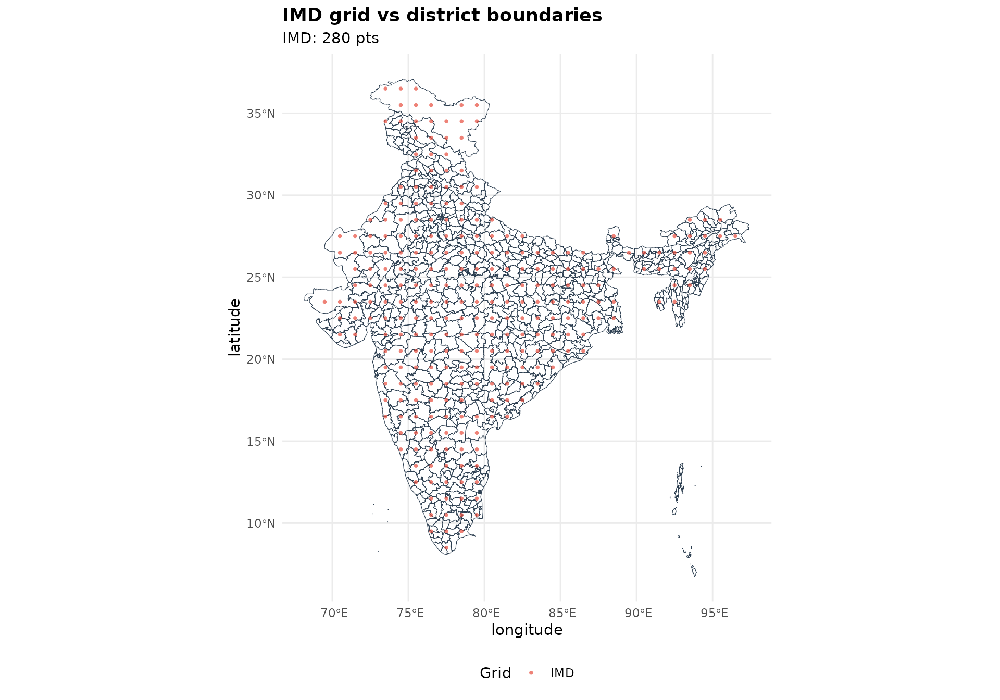
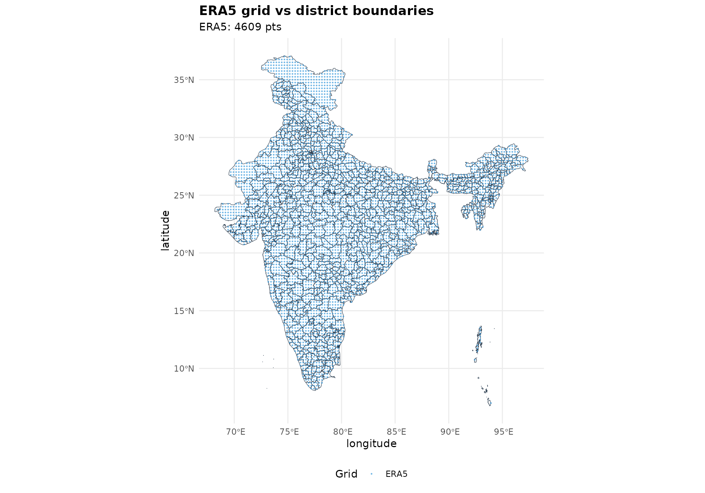
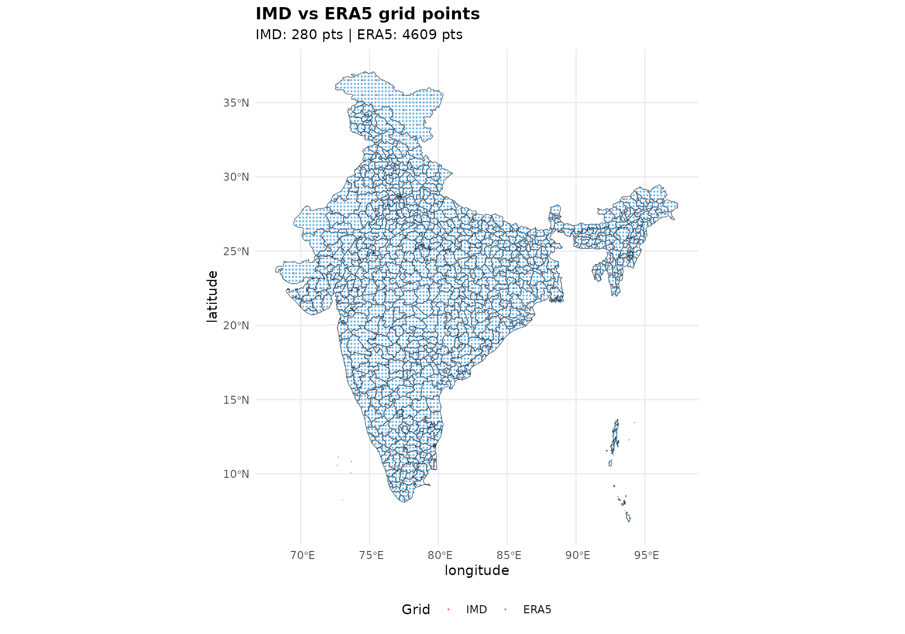
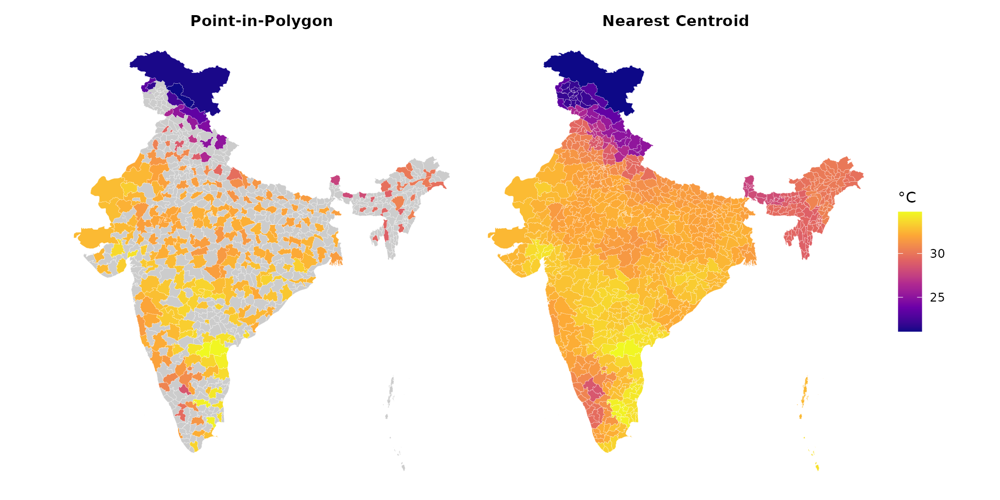
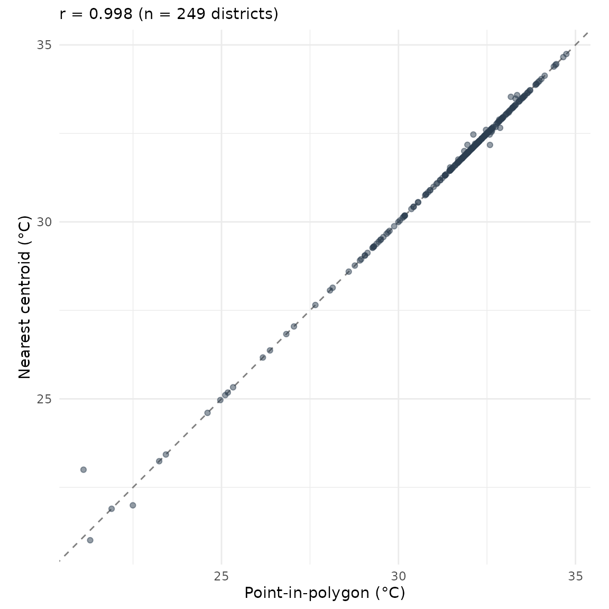

# Spatial aggregation methods

``` r
library(varunayan)
library(dplyr)
library(ggplot2)
library(sf)
library(patchwork)
```

## The Problem

Climate datasets like ERA5 and IMD provide data on regular grids (e.g.,
0.25° × 0.25°). When aggregating to administrative boundaries like
districts, smaller regions may not contain any grid points, resulting in
missing data.

``` r
districts_url <- "https://bharatviz.saketlab.org/India_LGD_districts.geojson"
districts_file <- "indian_districts.geojson"
if (!file.exists(districts_file)) {
  download.file(districts_url, districts_file, mode = "wb", timeout = 300)
}
districts_sf <- sf::st_read(districts_file, quiet = TRUE)

imd_tmax <- imd_temperature_geojson(
  request_id = "spatial_demo",
  start_year = 2023, end_year = 2023,
  geojson_file = districts_file,
  var_type = "tmax"
)

imd_spatial <- imd_tmax %>%
  group_by(longitude, latitude) %>%
  summarise(temp = mean(temperature, na.rm = TRUE), .groups = "drop")

era5_temp <- era5ify_geojson(
  request_id = "spatial_era5",
  variables = "2m_temperature",
  start_date = "2023-01-01",
  end_date = "2023-01-31",
  json_file = districts_file,
  frequency = "daily",
  resolution = 0.25
)

era5_spatial <- era5_temp %>%
  group_by(longitude, latitude) %>%
  summarise(temp = mean(value, na.rm = TRUE), .groups = "drop")
```

## Visualizing grid coverage

The
[`compare_grids()`](https://saketlab.github.io/varunayanR/dev/reference/compare_grids.md)
function shows how grid points align with polygon boundaries.

``` r
compare_grids(
  IMD = imd_spatial,
  point_size = 1,
  polygons = districts_sf,
  title = "IMD grid vs district boundaries"
)
```



``` r
compare_grids(
  ERA5 = era5_spatial,
  colors = c(ERA5 = "#3498DB"),
  point_size = 0.5,
  polygons = districts_sf,
  title = "ERA5 grid vs district boundaries"
)
```



``` r
compare_grids(
  IMD = imd_spatial,
  ERA5 = era5_spatial,
  point_size = 0.5,
  polygons = districts_sf,
  title = "IMD vs ERA5 grid points"
)
```



Red circles are IMD grid points, blue circles are ERA5 grid points. Many
small districts have no grid points within their boundaries.

## Coverage statistics

### IMD coverage

``` r
imd_coverage <- check_grid_coverage(imd_spatial, districts_sf, c("state_name", "district_name"))
cat("IMD Grid Coverage:\n")
#> IMD Grid Coverage:
cat("  Total districts:", imd_coverage$total_polygons, "\n")
#>   Total districts: 785
cat("  Grid points:", imd_coverage$total_grid_points, "\n")
#>   Grid points: 280
cat("  Districts with data:", imd_coverage$polygons_with_points, "\n")
#>   Districts with data: 249
cat("  Coverage:", imd_coverage$coverage_percent, "%\n")
#>   Coverage: 31.7 %
```

### ERA5 coverage

``` r
era5_coverage <- check_grid_coverage(era5_spatial, districts_sf, c("state_name", "district_name"))
cat("ERA5 Grid Coverage:\n")
#> ERA5 Grid Coverage:
cat("  Total districts:", era5_coverage$total_polygons, "\n")
#>   Total districts: 785
cat("  Grid points:", era5_coverage$total_grid_points, "\n")
#>   Grid points: 4609
cat("  Districts with data:", era5_coverage$polygons_with_points, "\n")
#>   Districts with data: 745
cat("  Coverage:", era5_coverage$coverage_percent, "%\n")
#>   Coverage: 94.9 %
```

## Aggregation methods

### Point-in-Polygon

The traditional approach uses spatial joins to find grid points within
each polygon:

``` r
result_pip <- aggregate_to_polygons(
  imd_spatial, districts_sf, "temp",
  method = "point_in_polygon",
  polygon_id_cols = c("state_name", "district_name")
)

cat("Districts with data:", sum(!is.na(result_pip$value)), "/", nrow(result_pip), "\n")
#> Districts with data: 249 / 785
```

### Nearest centroid

This method finds the nearest grid point to each polygon’s centroid:

``` r
result_nearest <- aggregate_to_polygons(
  imd_spatial, districts_sf, "temp",
  method = "nearest_centroid",
  polygon_id_cols = c("state_name", "district_name")
)

cat("Districts with data:", sum(!is.na(result_nearest$value)), "/", nrow(result_nearest), "\n")
#> Districts with data: 785 / 785
```

## Comparing results

``` r
make_map <- function(data, title) {
  map_sf <- districts_sf %>%
    left_join(data, by = c("state_name", "district_name"))

  ggplot(map_sf) +
    geom_sf(aes(fill = value), color = "white", linewidth = 0.05) +
    scale_fill_viridis_c(option = "plasma", na.value = "grey80", name = "°C") +
    labs(title = title) +
    theme_void() +
    theme(plot.title = element_text(hjust = 0.5, face = "bold", size = 11))
}

p1 <- make_map(result_pip, "Point-in-Polygon")
p2 <- make_map(result_nearest, "Nearest Centroid")

p1 + p2 + plot_layout(guides = "collect")
```



## Value comparison

For districts that have data in both methods:

``` r
comparison <- result_pip %>%
  rename(pip = value) %>%
  inner_join(
    result_nearest %>% rename(nearest = value),
    by = c("state_name", "district_name")
  ) %>%
  filter(!is.na(pip) & !is.na(nearest))

cor_val <- cor(comparison$pip, comparison$nearest, use = "complete.obs")

ggplot(comparison, aes(x = pip, y = nearest)) +
  geom_abline(slope = 1, intercept = 0, linetype = "dashed", color = "grey50") +
  geom_point(alpha = 0.5, color = "#2C3E50") +
  coord_fixed() +
  labs(
    x = "Point-in-polygon (°C)",
    y = "Nearest centroid (°C)",
    subtitle = sprintf("r = %.3f (n = %d districts)", cor_val, nrow(comparison))
  ) +
  theme_minimal()
```


