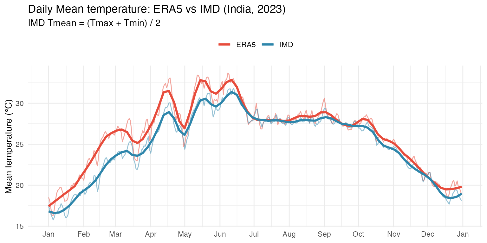
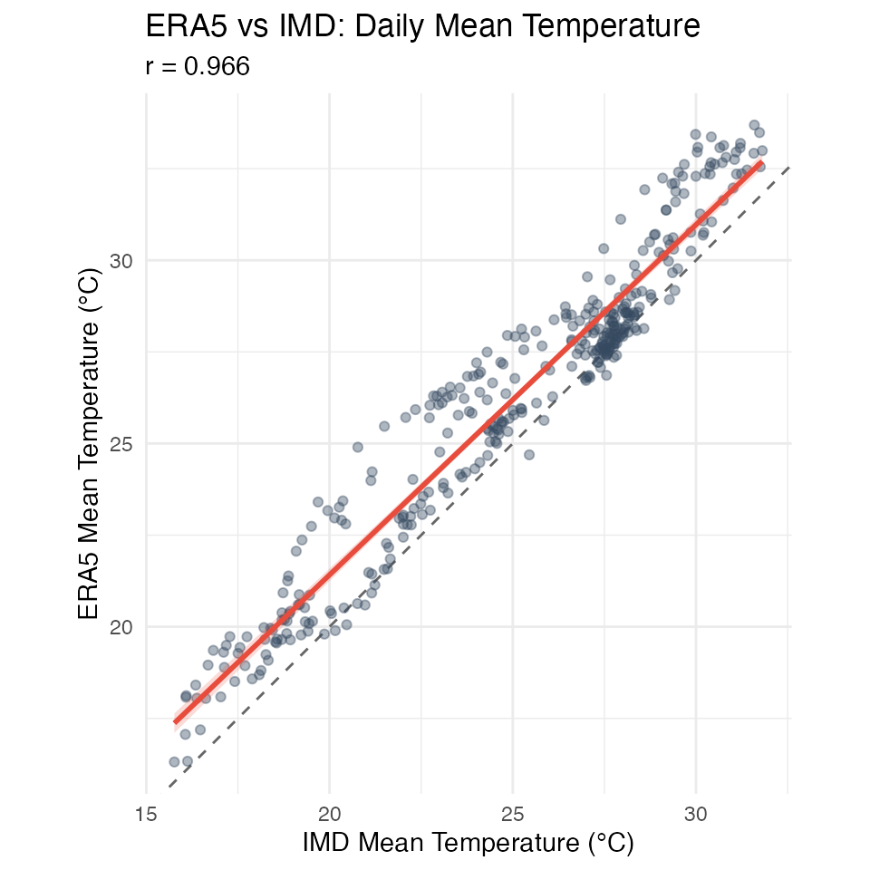
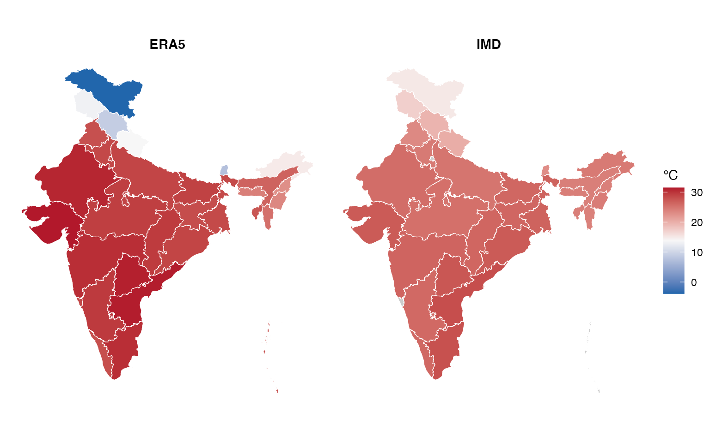
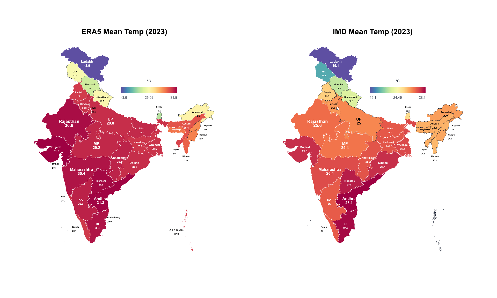

# ERA5 vs IMD: Temperature comparison (2023)

``` r

library(varunayan)
library(dplyr)
library(ggplot2)
library(sf)
library(patchwork)
```

``` r

states_url <- "https://bharatviz.saketlab.org/India_LGD_states.geojson"
states_file <- "indian_states.geojson"
if (!file.exists(states_file)) download.file(states_url, states_file, mode = "wb")
states_sf <- sf::st_read(states_file, quiet = TRUE)
```

## Download Data

``` r

era5_temp <- era5ify_geojson(
  request_id = "era5_temp_2023",
  variables = "2m_temperature",
  start_date = "2023-01-01",
  end_date = "2023-12-31",
  json_file = states_file,
  frequency = "daily",
  resolution = 0.25
) %>%
  mutate(date = as.Date(datetime))
#>   |                                                                              |                                                                      |   0%
#>   |                                                                              |======                                                                |   8%
#>   |                                                                              |============                                                          |  17%
#>   |                                                                              |==================                                                    |  25%
#>   |                                                                              |=======================                                               |  33%
#>   |                                                                              |=============================                                         |  42%
#>   |                                                                              |===================================                                   |  50%
#>   |                                                                              |=========================================                             |  58%
#>   |                                                                              |===============================================                       |  67%
#>   |                                                                              |====================================================                  |  75%
#>   |                                                                              |==========================================================            |  83%
#>   |                                                                              |================================================================      |  92%
#>   |                                                                              |======================================================================| 100%
```

``` r

imd_tmax <- imd_temperature_geojson(
  request_id = "imd_tmax_2023",
  start_year = 2023, end_year = 2023,
  geojson_file = states_file,
  var_type = "tmax"
) %>% mutate(date = as.Date(date), var = "Tmax")
```

``` r

imd_tmin <- imd_temperature_geojson(
  request_id = "imd_tmin_2023",
  start_year = 2023, end_year = 2023,
  geojson_file = states_file,
  var_type = "tmin"
) %>% mutate(date = as.Date(date), var = "Tmin")
```

## Temperature comparison

``` r

# ERA5 daily mean temperature (spatial mean per day)
era5_daily <- era5_temp %>%
  group_by(date) %>%
  summarise(temp = mean(value, na.rm = TRUE), .groups = "drop") %>%
  mutate(source = "ERA5")

# IMD: Calculate Tmean from (Tmax + Tmin) / 2
imd_tmax_daily <- imd_tmax %>%
  group_by(date) %>%
  summarise(tmax = mean(temperature, na.rm = TRUE), .groups = "drop")

imd_tmin_daily <- imd_tmin %>%
  group_by(date) %>%
  summarise(tmin = mean(temperature, na.rm = TRUE), .groups = "drop")

imd_daily <- inner_join(imd_tmax_daily, imd_tmin_daily, by = "date") %>%
  mutate(temp = (tmax + tmin) / 2, source = "IMD") %>%
  select(date, temp, source)

temp_all <- bind_rows(era5_daily, imd_daily)
```

``` r

ggplot(temp_all, aes(x = date, y = temp, color = source)) +
  geom_line(alpha = 0.5) +
  geom_smooth(method = "loess", span = 0.1, se = FALSE, linewidth = 1.2) +
  scale_x_date(date_breaks = "1 month", date_labels = "%b") +
  scale_color_manual(values = c("ERA5" = "#E74C3C", "IMD" = "#2E86AB")) +
  labs(
    x = NULL, y = "Mean temperature (°C)", color = NULL,
    title = "Daily Mean temperature: ERA5 vs IMD (India, 2023)",
    subtitle = "IMD Tmean = (Tmax + Tmin) / 2"
  ) +
  theme_minimal() +
  theme(legend.position = "top")
```



``` r

temp_wide <- inner_join(
  era5_daily %>% select(date, ERA5 = temp),
  imd_daily %>% select(date, IMD = temp),
  by = "date"
)

# Calculate correlation
cor_val <- cor(temp_wide$ERA5, temp_wide$IMD, use = "complete.obs")

ggplot(temp_wide, aes(x = IMD, y = ERA5)) +
  geom_abline(slope = 1, intercept = 0, linetype = "dashed", color = "grey40") +
  geom_point(alpha = 0.4, size = 1.5, color = "#34495E") +
  geom_smooth(method = "lm", se = TRUE, color = "#E74C3C", fill = "#E74C3C", alpha = 0.2) +
  coord_fixed() +
  labs(
    x = "IMD Mean Temperature (°C)", y = "ERA5 Mean Temperature (°C)",
    title = "ERA5 vs IMD: Daily Mean Temperature",
    subtitle = sprintf("r = %.3f", cor_val)
  ) +
  theme_minimal()
```



## ERA5 vs IMD

``` r

# Aggregate to state level
join_to_states <- function(data, value_col, states) {
  pts <- st_as_sf(data, coords = c("longitude", "latitude"), crs = 4326)
  st_join(states, pts) %>%
    as.data.frame() %>%
    group_by(state_name) %>%
    summarise(value = mean(.data[[value_col]], na.rm = TRUE), .groups = "drop")
}

# ERA5 mean temp by state
era5_states <- join_to_states(
  era5_temp %>% group_by(longitude, latitude) %>% summarise(temp = mean(value, na.rm = TRUE), .groups = "drop"),
  "temp", states_sf
)

# IMD mean temp by state: (Tmax + Tmin) / 2
imd_tmax_spatial <- imd_tmax %>%
  group_by(longitude, latitude) %>%
  summarise(tmax = mean(temperature, na.rm = TRUE), .groups = "drop")

imd_tmin_spatial <- imd_tmin %>%
  group_by(longitude, latitude) %>%
  summarise(tmin = mean(temperature, na.rm = TRUE), .groups = "drop")

imd_mean_spatial <- inner_join(imd_tmax_spatial, imd_tmin_spatial, by = c("longitude", "latitude")) %>%
  mutate(temp = (tmax + tmin) / 2)

imd_states <- join_to_states(imd_mean_spatial, "temp", states_sf)

make_temp_map <- function(states_sf, data, title, limits) {
  map_sf <- states_sf %>% left_join(data, by = "state_name")
  ggplot(map_sf) +
    geom_sf(aes(fill = value), color = "white", linewidth = 0.2) +
    scale_fill_gradient2(
      low = "#2166AC", mid = "#F7F7F7", high = "#B2182B",
      midpoint = mean(limits),
      limits = limits, name = "°C", na.value = "grey80"
    ) +
    labs(title = title) +
    theme_void() +
    theme(plot.title = element_text(hjust = 0.5, face = "bold", size = 11))
}

temp_limits <- range(c(era5_states$value, imd_states$value), na.rm = TRUE)

p1 <- make_temp_map(states_sf, era5_states, "ERA5", temp_limits)
p2 <- make_temp_map(states_sf, imd_states, "IMD", temp_limits)

p1 + p2 + plot_layout(ncol = 2, guides = "collect") &
  theme(legend.position = "right")
```



## Using BharatViz

[BharatViz](https://bharatviz.saketlab.org) provides publication-ready
choropleth maps of India.

``` r

era5_api_data <- era5_states %>%
  filter(!is.na(value)) %>%
  transmute(state = state_name, value = round(value, 1))

imd_api_data <- imd_states %>%
  filter(!is.na(value)) %>%
  transmute(state = state_name, value = round(value, 1))
```

``` r

library(R6)
library(gridExtra)
source("https://raw.githubusercontent.com/saketlab/bharatviz/refs/heads/main/server/examples/bharatviz.R")

bv <- BharatViz$new()

# Generate maps
era5_result <- bv$generate_map(era5_api_data, title = "ERA5 Mean Temp (2023)", legend_title = "°C")
imd_result <- bv$generate_map(imd_api_data, title = "IMD Mean Temp (2023)", legend_title = "°C")

# Display side by side
era5_grob <- bv$get_grob(era5_result)
imd_grob <- bv$get_grob(imd_result)

grid.arrange(era5_grob, imd_grob, ncol = 2)
```


